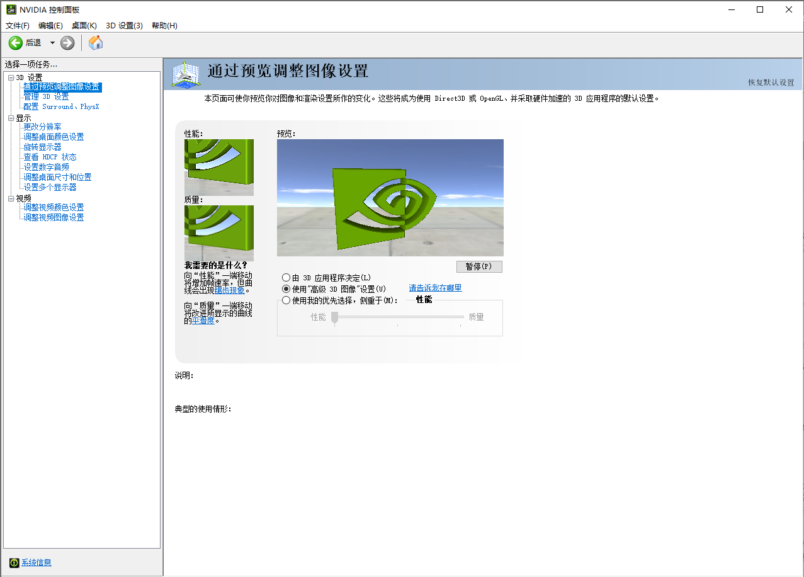
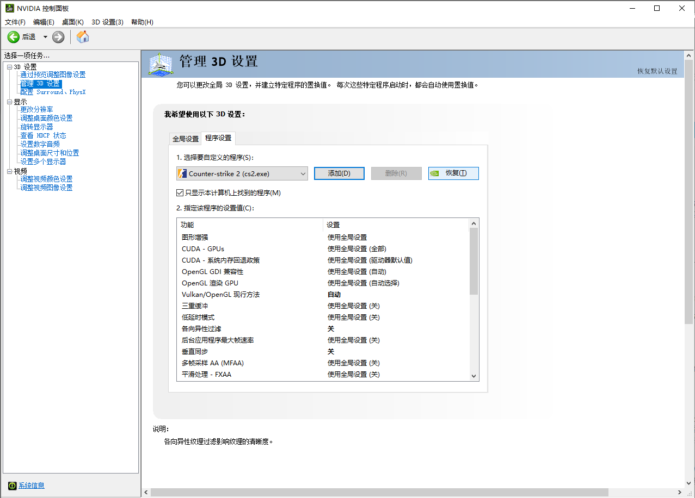
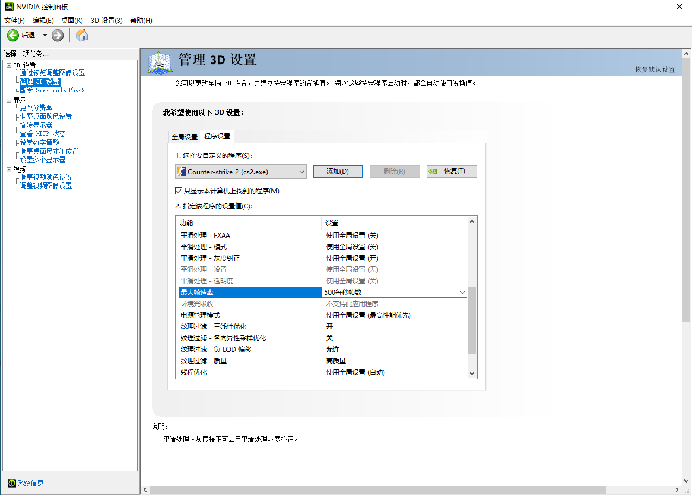
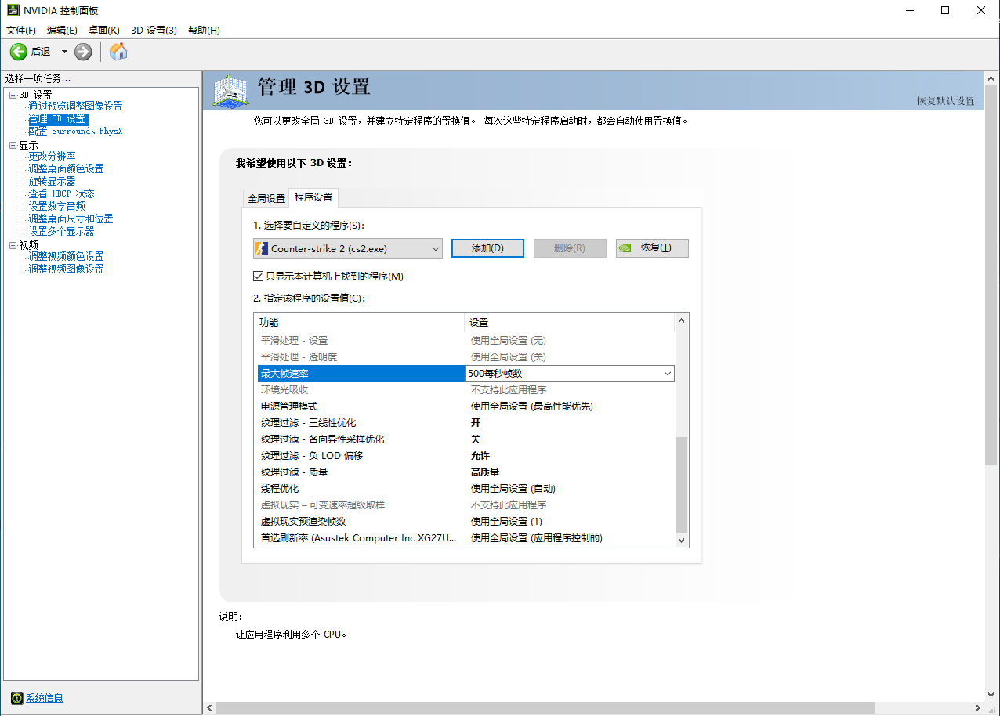
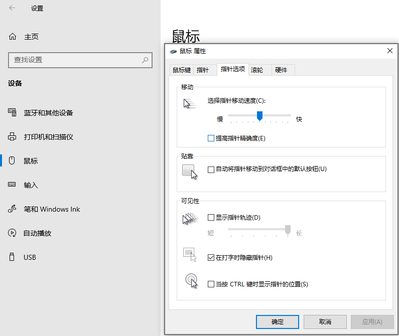
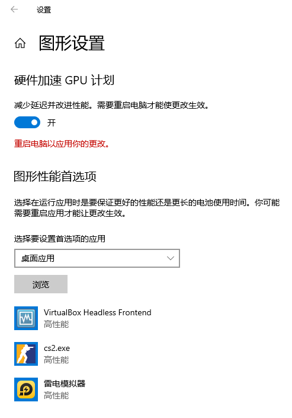
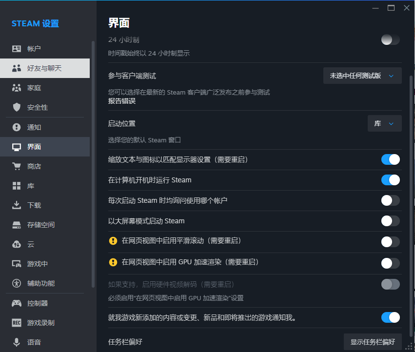
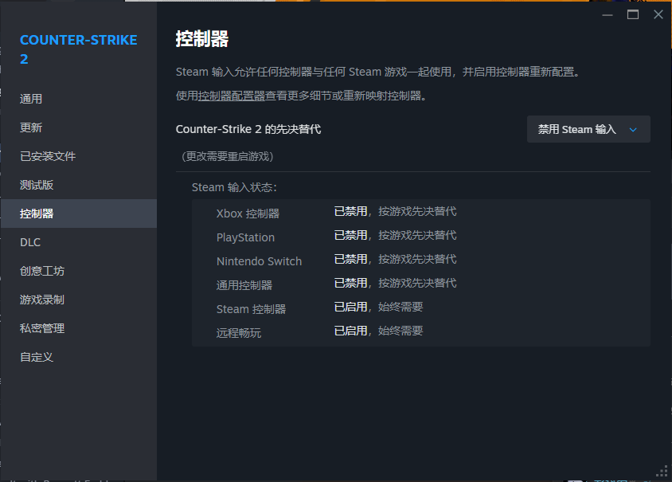

<center><h1>CS2 Playbook CS2 Settings</h1></center>

# 1 游戏外设置

## 1.1 NVIDIA设置

1. 通过预览调整图像设置->使用高级3D设置

   

2. 管理3D设置

   

   

   


## 1.2 Windows系统设置






## 1.3 Steam设置






## 1 启动选项

```
-worldwide // 国际服
-perfectworld // 国服
```


## 2 视频设置

| 选项     | 属性         |
| -------- | ------------ |
| 显示模式 | 全屏窗口模式 |
| 纵横比   | 标准4:3      |
| 分辨率   | 1280×960     |
| 刷新率   | 320HZ        |
| 亮度     | 93%          |


## 3 高级视频设置

| 选项                   | 属性    |
| ---------------------- | ------- |
| 增强角色对比度         | 启用    |
| V-Sync                 | 已禁用  |
| NVIDIA G-Sync          | 已禁用  |
| NVIDIA Relfex 低延迟   | 已禁用  |
| 游戏最高FPS            | 0       |
| 菜单最高FPS            | 200     |
| 当前视频值预设         | 自定义  |
| 多重采样抗锯齿模式     | 8X MSAA |
| 全局阴影效果           | 高      |
| 动态阴影               | 全部    |
| 模型/贴图细节          | 高      |
| 贴图过滤模式           | 异向4X  |
| 光影细节               | 低      |
| 粒子细节               | 低      |
| 环境光遮蔽             | 已禁用  |
| 高动态范围             | 品质    |
| Fidelity FX 超级分辨率 | 已禁用  |


## 4 准星

淡蓝色粗十字准星：`CSGO-wAD3c-ykt5L-zvZ98-vBisR-6sWPA`

| 准星代码                           | 类型           | 颜色   | 画面      | 代表选手 |
| ---------------------------------- | -------------- | ------ | --------- | -------- |
| CSGO-A6hQO-ZcwiC-amvwt-JsEMB-8vsyM | 细中长实心十字 | 浅蓝色 | 1440*1080 |          |
| CSGO-bAeSc-opkQk-4ToZo-X9abG-iUVaK | 细中长空心十字 | 浅绿色 | 1440*1080 |          |
| CSGO-AkTYm-syAcf-UKom7-tGKdM-mOJvM | 粗短空心十字   | 浅绿色 | 1440*1080 | donk     |
| CSGO-wAD3c-ykt5L-zvZ98-vBisR-6sWPA | 粗短空心十字   | 浅蓝色 | 1440*1080 | Niko     |
| CSGO-nCfX7-54ue9-aC5eV-6Womf-Q6izO | 细长空心十字   | 浅绿色 | 1440*1080 | ropz     |

- 准星创意工坊：Top 10 teams crosshair gener


## 5 持枪视角

```
viewmodel_fov 65; viewmodel_offset_x -0.5; viewmodel_offset_y 1; viewmodel_offset_z -2; viewmodel_presetpos 1; // NiKo
viewmodel_fov 68; viewmodel_offset_x 2.5; viewmodel_offset_y 0; viewmodel_offset_z -1.5; viewmodel_presetpos 2; // ZywOo
viewmodel_fov 60; viewmodel_offset_x 0; viewmodel_offset_y 1; viewmodel_offset_z -2; viewmodel_presetpos 0; // iM
```
