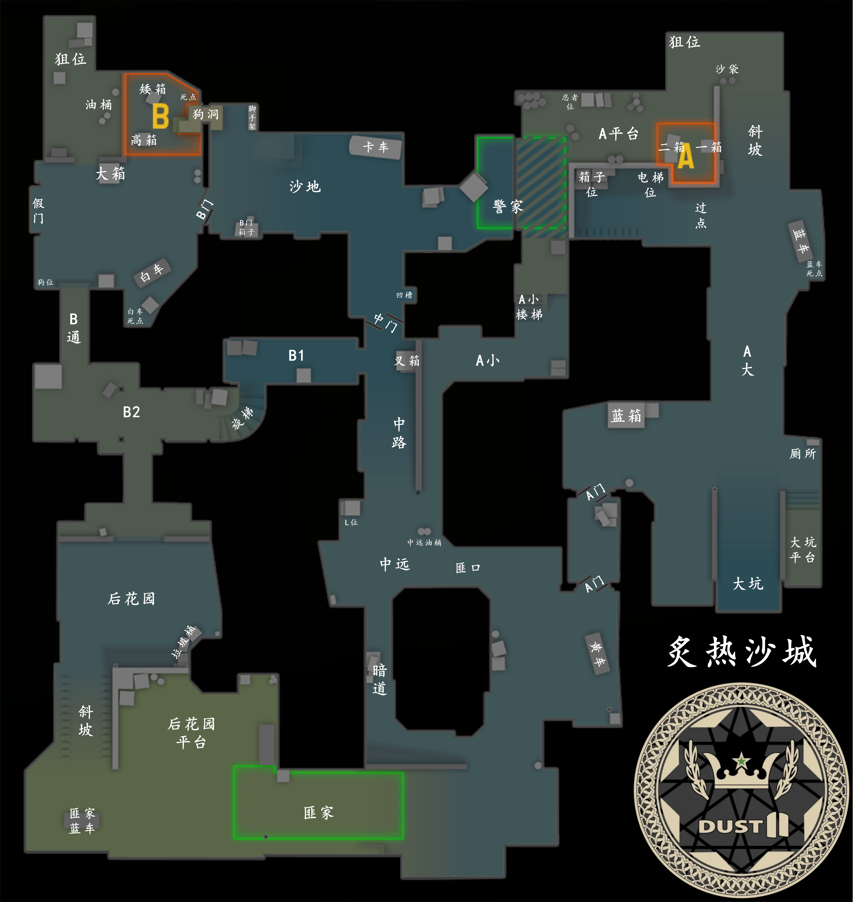
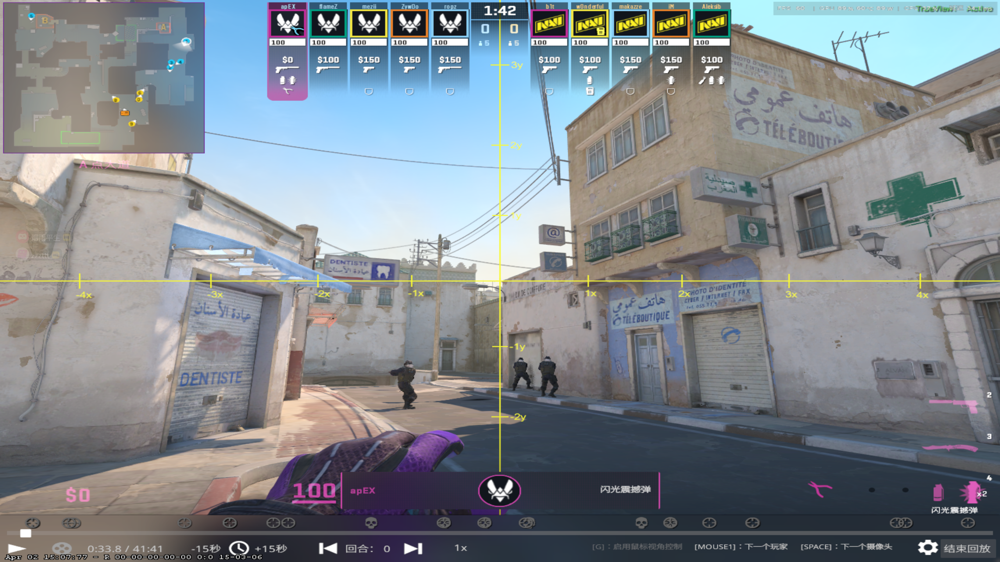
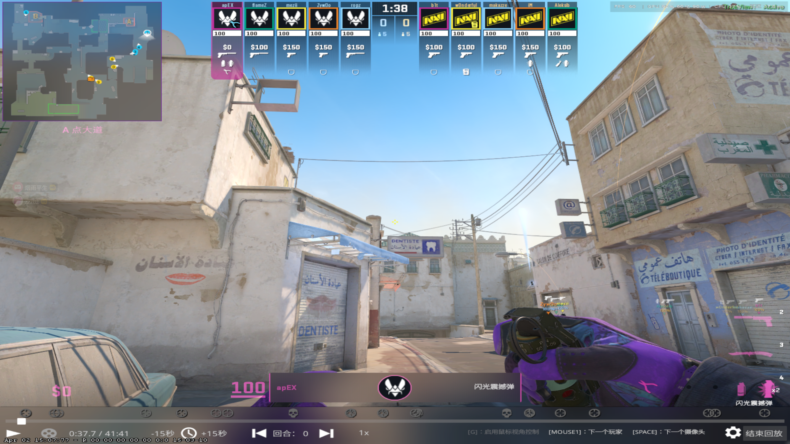
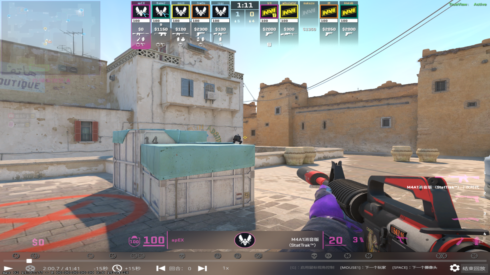
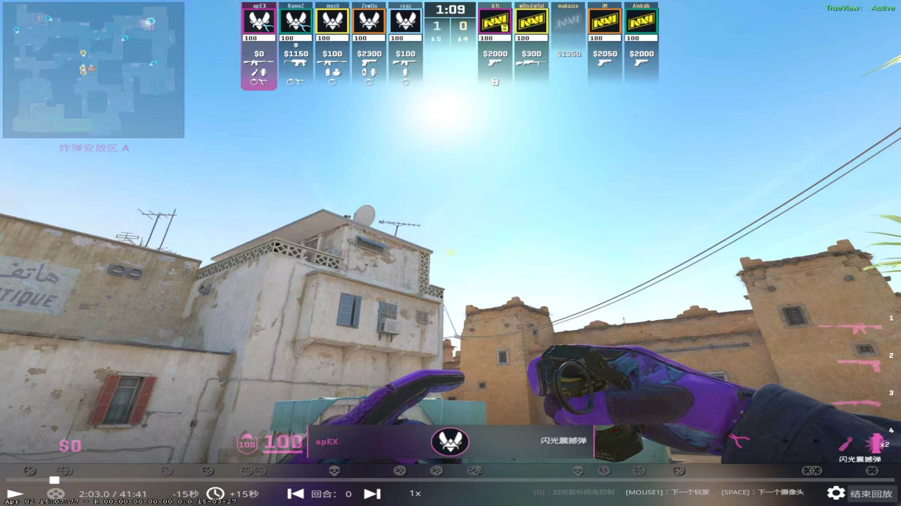
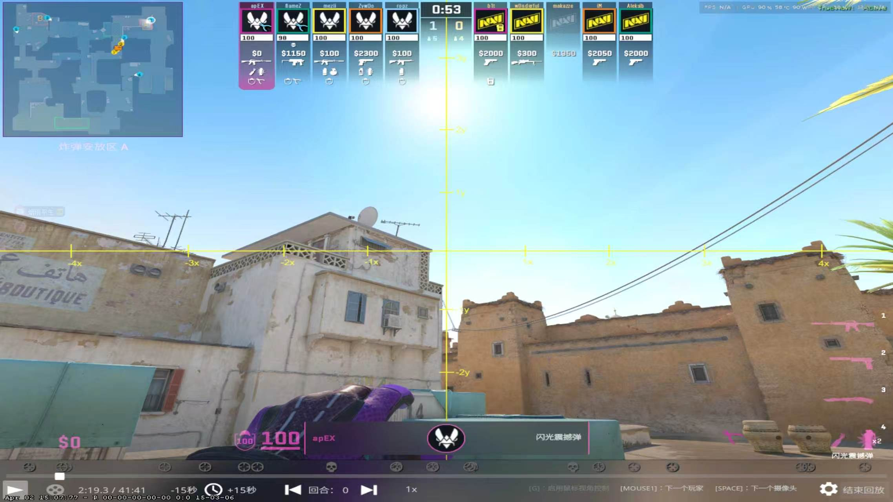
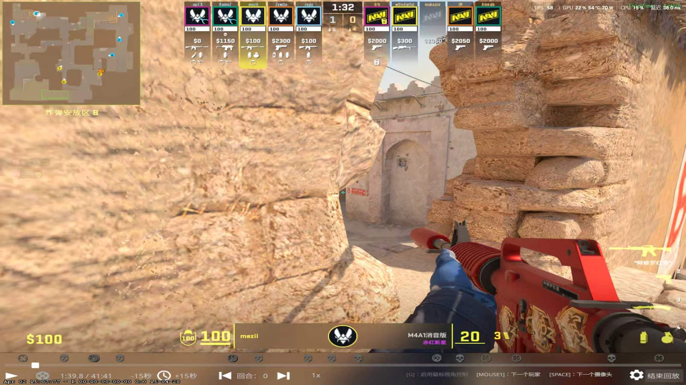
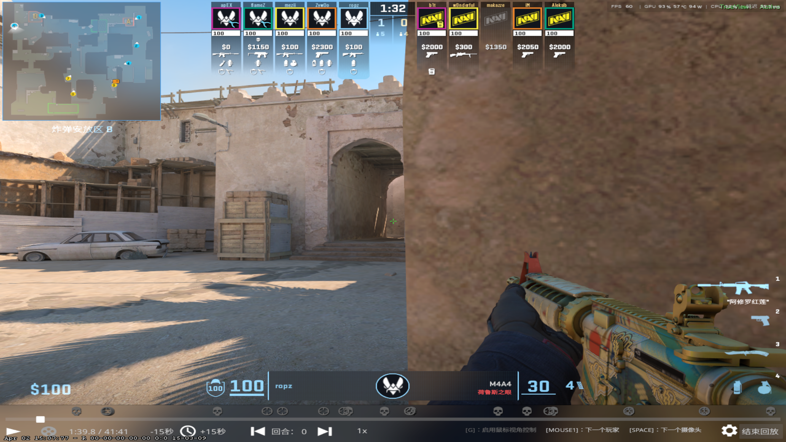

# Dust2 地图结构及分析

## Dust2 地图报点

# T方大型战术

# CT方防守站位

## 手枪局

### 4A+1B

#### A区

三人顶A大近点，1人蓝车捏闪（至少3颗）。听声音先给瞄准墙角的闪光，然后近点三人拉出对枪，后续给第二张图中的闪光。

#### B区

B点大箱后晃看，抗压。

## Anti-eco局

### 3A+2B

#### A区

#### B区

一人站假门直架，一人狗洞带中路。假门接一个之后藏起来，狗洞辅助架过点打交叉。

