# Dust2 地图结构及分析

## Dust2 地图报点

# CT方防守站位

## 手枪局

### 4A+1B

#### A区

三人顶A大近点，1人蓝车捏闪（至少3颗）。听声音先给瞄准墙角的闪光，然后近点三人拉出对枪，后续给第二张图中的闪光。

#### B区

B点大箱后晃看，抗压。

## Anti-eco局

### 3A+2B

#### A区

#### B区

一人站假门直架，一人狗洞带中路。假门接一个之后藏起来，狗洞辅助架过点打交叉。

# T方默认

## A大

### 第一时间抢A大

> 第一身位的人刚刚走到A门口时左键跳投，同样位置给第二颗闪光。
>
> 辅助闪光贴匪口箱子瞄准窗框左上角左键跳投。
>
> 投掷的时候需要注意，不要同一时间给闪，而是要交替给闪。
>
> 要有A大保护烟，图三是快烟瞄点，左键跳投。
>
> 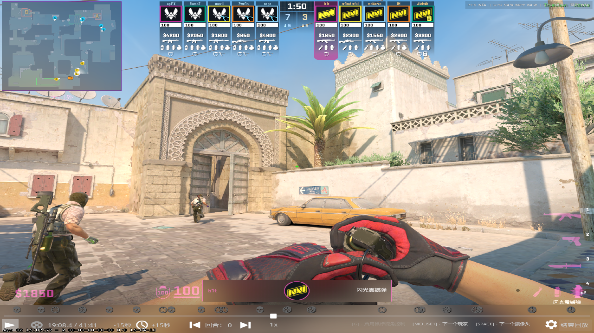
>
> 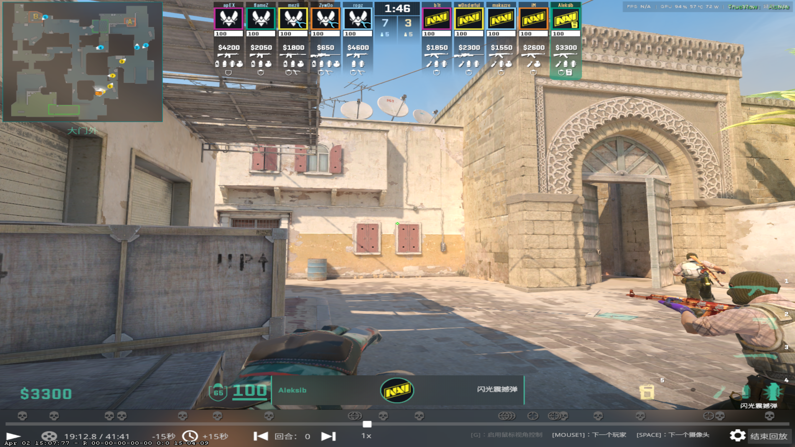
>
> 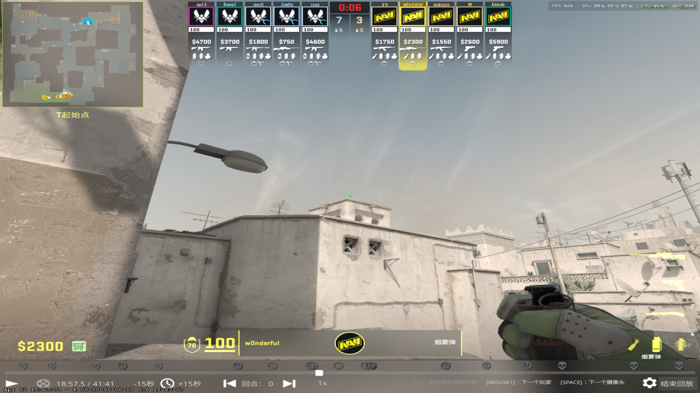

### 第二时间出A大

> 黄车后站到地上砖渍中间，高闪瞄准墙上污渍，左键跳投。
>
> 出门闪蹲着瞄准黄车车胎，左键蹲跳投。
>
> 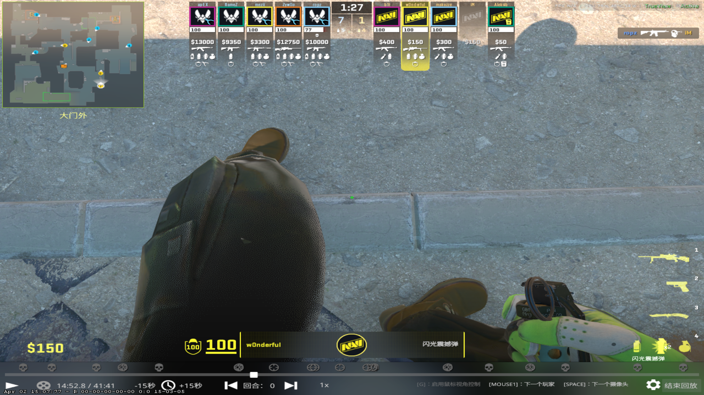
>
> 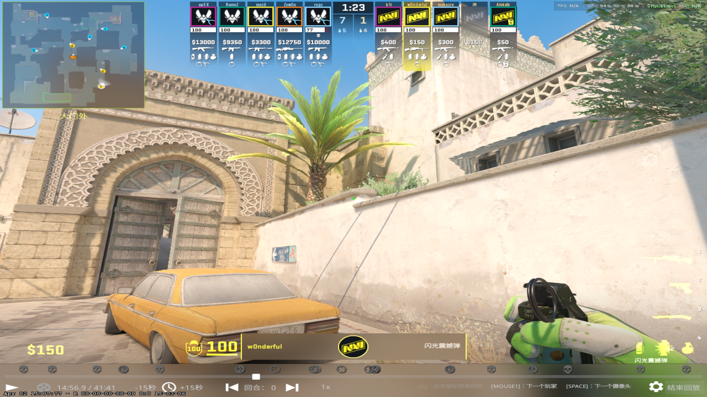
>
> 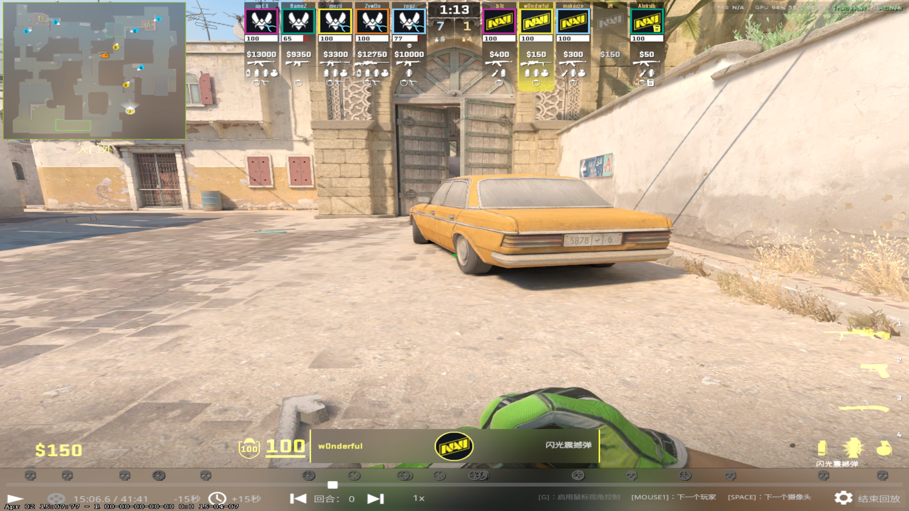

## A小

### A小楼梯

> A小楼梯闪，贴拱门右侧，瞄准房顶尖角，左键跳投。
>
> 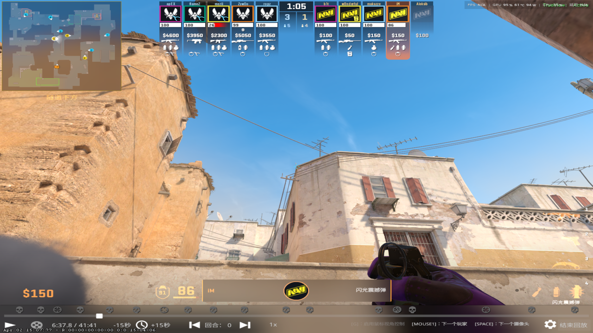

## 中门

### 中门凹槽火

> 站在A小，瞄准门槛内侧，弹内侧门槛让火落在中门右侧，烧中门近点和凹槽。
>
> 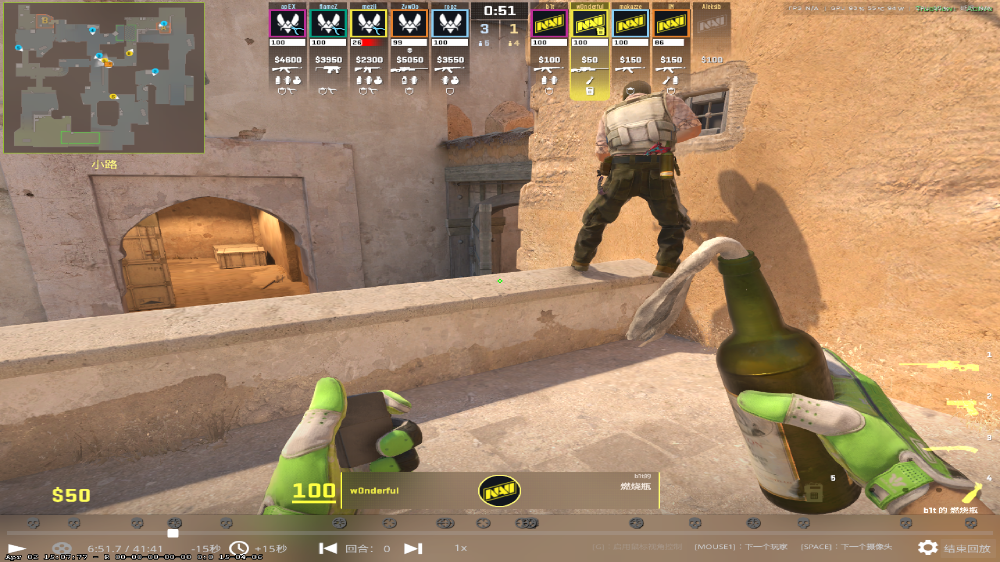

### 警家烟

> 抵住A小石墙中间，瞄准中门左上角第一条竖杠中间，左键跳投。
>
> 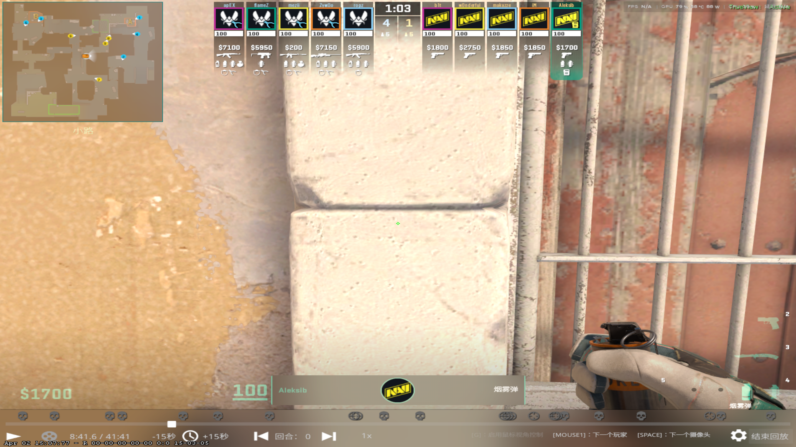
>
> 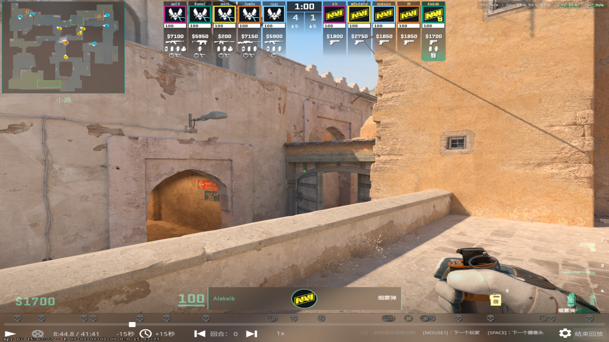

### 中门闪

> 中远油桶后面，瞄准中门门缝对齐的门沿上，跑一步左键投掷。
>
> 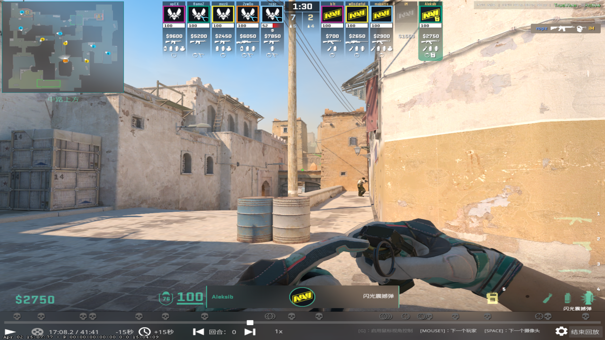

# T方大型战术

## RushB

