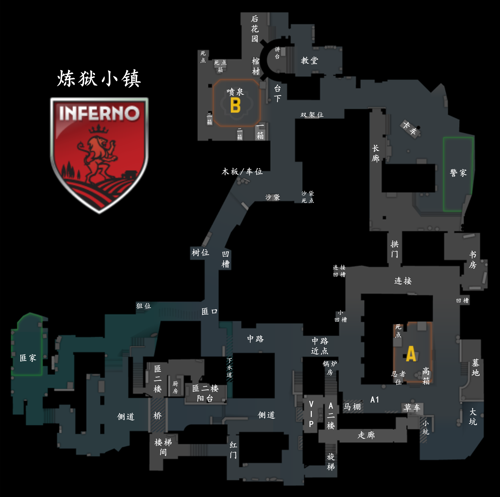

<h1>
CS2 Playbook Inferno
</h1>

## 1 Inferno 地图结构及分析

### 1.1 Inferno 地图报点

# 2 默认控图

## 2.1 T方

小镇进攻方默认位置如下：

- 香蕉道主控
- 香蕉道辅控
- 中路主控
- VIP主控
- 旋梯主控

### 2.1.1 香蕉道

#### 快控

1. 香蕉道主控给001 车位火，香蕉道辅控给1分47秒002 窗口闪。
2. 香蕉道主控给完车位火后不要马上去往中段，贴右墙左右peek，防止CT前压，并小心对方踩火狙。
3. 待车位火完全蔓延后但未熄灭前投掷003 黄墙雷，随后来到凹槽给004 中段烟。
4. 中段烟爆后，混烟观察CT站位，同时小心CT反混。
5. 树位架枪，等队友完成后续控图。

#### 慢控

1. 香蕉道主控给中段烟（随手给），烧005 中段火，并混入匪口烟。
2. 中段火快熄灭时，香蕉道辅控给006 双键闪光，香蕉道主控出匪口烟控制中段。

VIP默认

旋梯默认

侧道道具位默认

中路默认

## 2.2 CT方

# 3 道具

## 3.1 T方

### 001 车位火

- 站位：贴蕉道右墙
- 瞄点：瞄准空窗中间
- 投掷方式：跑一步（满地速）+左键

### 002 窗口闪

- 站位：抵住石墙拐角
- 瞄点：瞄准污渍中间对齐拱门下檐
- 投掷方式：左键+跳投

### 003 黄墙雷

- 站位：香蕉道中段
- 瞄点：高度与房檐平齐，垂直对齐黄墙偏右
- 投掷方式：下蹲+左键

### 004 中段烟

- 站位：凹槽前点
- 瞄点：木头铁箍左下边沿
- 投掷方式：左键

### 005 中段火

- 站位：贴后墙，让准星处的窗户左侧与墙体相交
- 瞄点：窗户内框右上角
- 投掷方式：静步走一步+左键

### 006 双键闪光

- 站位：贴后墙墙体与窗口右侧平齐
- 瞄点：瞄准房檐
- 投掷方式：双键

## 3.2 CT方